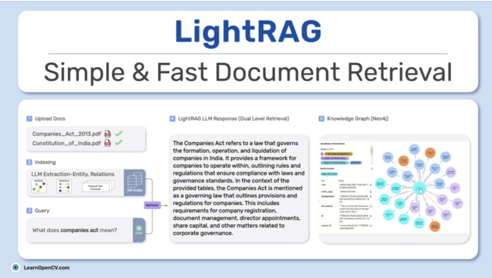
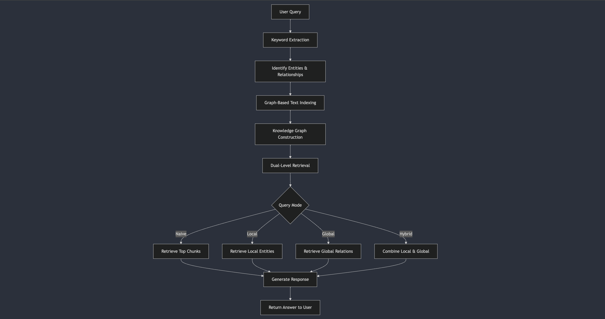

# LightRAG Knowledge Graph for Post Proudction use case:



## What is the purpose of this repository:

The purpose of this repository is to provide a structured implementation of the LightRAG framework for processing and querying large documents, such as the Post Production Handbook. It leverages a local language model to extract, index, and retrieve information efficiently using a knowledge graph approach. This setup is designed to facilitate complex queries and provide insightful responses, making it a valuable tool for professionals in the post-production industry.The repository is organized to separate custom code from the original LightRAG framework, ensuring clarity and ease of maintenance.

## How lightRAG works:




## Setup

```bash
git clone git@github.com:cookieclicker123/lightrag_knowledge_graph_poc.git
cd lightrag
python3 -m venv .venv
source .venv/bin/activate
pip install -r requirements.txt
mkdir data
mkdir outputs
```

## Download PDF for demo or use your own:

```bash
https://soma.sbcc.edu/users/davega/FILMPRO_181_AUDIO_I/FILMPRO_181_02_Assignments/07_AUDIO_WORKFLOW_DOCS/POST%20GUIDES/Post%20Production%20Handbook%202014.pdf
```

 - Name this 'Post_Production_Handbook_2014.pdf' and store in 'data' folder.

## Index any PDF, large or small

 - make sure you store your pdf in 'data'

 - Visit index_file.py, and change PDF_PATH variable accordingly. Then run:

```bash
python index_file.py
```

 - the prompt in the lightrag module (prompt.py) completely generalises, so although the focus here is for our use case of TV Post production, this framework is very robust and works for any use case.

 - Simply run this file, wait for a minute, and you should see your pdf being chunked. 
 – If you use my one, you should get get roughly 39 chunks which will take about 30 mins, 3.87 pages per chunk (1200) tokens.

 - Not too course, not too granular; a great chunking strategy for the unstructured data in pdf's from lightrag.

 ## Run the Gradio Web App

```bash
python app.py
#Look for the url and highlight and click on it to go to web app
'* Running on local URL:  http://127.0.0.1:7860'

```

  - Once this is finished, you will be able to observe in data much has changed and that you have all the files you need.
 - You will first observe the number of nodes and edges created, and will then be able to visit the data folder and
 see the specific details of how it.
 - We chunked and tokenised with pymupdf
 - used lightrag with networkx to construct an impressive knowledge graph
 - And made the embeddings for this knowledge graph with nomic-embed-text.


## Observations

 - 4 Options are provided to stress test and compare the performance of different rag methods.
   - Naieve Rag (standard semantic search)
   - Local (using light rag for local nodes (things at a root level e.g 'cow') this is useful for specific info)
   - Global (using light rag for global nodes (things at a holistic level e.g 'Agriculture') this is useful for
   understnading the dependencies and relationships amoung things at a higher level)
   - Hybrid ( Reaches a sweet spot between local and global, utilising the full power of lightrags knowledge graph)

 - What I observe is semantic search is very vague, often uninformative on larger documents. It cant string chunks 
 vector space wide because inherently it assumes everything similiar is close. You can only ask so much from this
 - Local is amazing for granular searches where you need highly specific info
 - Global is incredible at stringing together chunks far and wide in the graph, utilising robust key value pair 
 entities and relationships whose values are embeddings to allow nuance within the structure.
 - Hybrid certainly the best approach, for highly accurate responses with maximum knowledge base coverage.

This web app really helps us shed light on why basic semantic search simply is not tenable when trying to get the most out of your data, let alone fields in which accuracy and quality of responses is vital, and in which semnatic search would not cut it but as you will see lightrag based knowledge graph data certainly is.

I Advise you test the same query with gpt-4o as arbiter so you can see an in depth x/10 rating on each 
retreival method. This will really elucidate the effectiveness and neccesity of graph rag in 
the growing use case demands in AI.